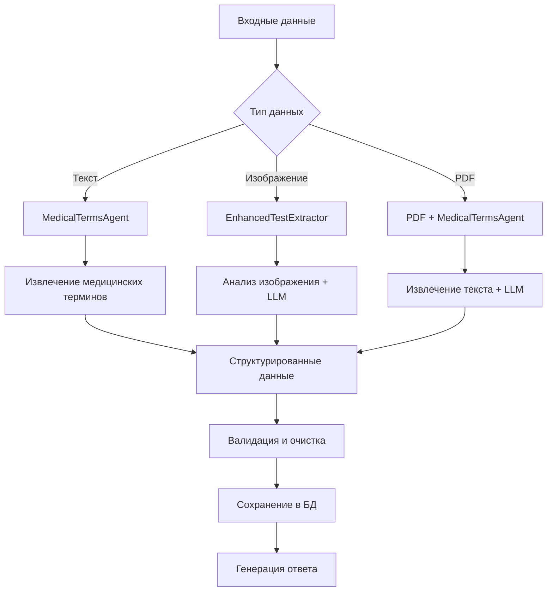

# LLM Function Calling Implementation

## Обзор

В данном проекте реализована система замены хардкода медицинских терминов на интеллектуальную LLM-систему с function calling. Это позволило значительно улучшить точность и гибкость обработки медицинских анализов.

## Проблемы до внедрения

### 1. Хардкод медицинских терминов
```python
# Было (в utils.py):
medical_terms = [
    "гепатит", "hcv", "hbv", "hbsag", "антитела", "igg", "igm", "ige",
    "opisthorchis", "toxocara", "lamblia", "ascaris", "hepatitis",
    "ferritin", "tsh", "церулоплазмин", "с-реактивный белок"
]
```

**Проблемы:**
- Ограниченный список терминов
- Нет учета новых медицинских тестов
- Жесткая привязка к конкретным названиям
- Отсутствие контекстной обработки

### 2. Ошибки сериализации
```
ERROR:root:Ошибка при сохранении медицинской записи: Object of type CompletionUsage is not JSON serializable
```

### 3. Проблемы с обработкой PDF
- Неструктурированное извлечение данных
- Отсутствие валидации результатов
- Проблемы с форматированием

## Решение: LLM Function Calling

### 1. Медицинский агент (`medical_terms_agent.py`)

Создан специализированный агент для работы с медицинскими терминами:

```python
class MedicalTermsAgent:
    """Агент для работы с медицинскими терминами с использованием LLM"""
    
    async def extract_medical_keywords(self, text: str) -> List[str]:
        """Извлечение медицинских ключевых слов из текста"""
        
    async def categorize_medical_test(self, test_name: str) -> Dict[str, Any]:
        """Категоризация медицинского теста"""
        
    async def extract_test_parameters(self, text: str) -> List[Dict[str, Any]]:
        """Извлечение параметров анализов из текста"""
```

### 2. Function Calling для извлечения данных

Пример системного промпта:
```python
system_prompt = """Ты — медицинский эксперт по анализу лабораторных анализов. 
Проанализируй текст и извлеки структурированные данные о медицинских тестах.

Верни ответ в формате JSON со следующей структурой:
{
  "extracted_tests": [
    {
      "test_name": "название теста",
      "result": "результат",
      "reference_values": "референсные значения",
      "units": "единицы измерения",
      "test_date": "дата теста",
      "laboratory": "лаборатория"
    }
  ]
}"""
```

### 3. Улучшенная обработка ошибок

#### Исправление сериализации в `database.py`:
```python
# Обрабатываем usage данные отдельно, чтобы избежать ошибок сериализации
usage_data = metadata.get("usage", {})
if usage_data:
    try:
        if hasattr(usage_data, 'dict'):
            usage_serializable = usage_data.dict()
        elif hasattr(usage_data, '__dict__'):
            usage_serializable = {
                k: str(v) if not isinstance(v, (str, int, float, bool, list, dict)) else v
                for k, v in usage_data.__dict__.items()
            }
        else:
            usage_serializable = usage_data
        
        save_data["usage"] = json.dumps(usage_serializable, ensure_ascii=False)
    except Exception as e:
        save_data["usage"] = json.dumps({"error": "serialization_failed"})
```

### 4. Улучшенная обработка PDF документов

```python
# Используем медицинский агент для извлечения структурированных данных из PDF
from medical_terms_agent import medical_terms_agent

# Извлекаем параметры анализов с помощью LLM
test_parameters = await medical_terms_agent.extract_test_parameters(pdf_text)

if test_parameters:
    # Генерируем анализ на основе структурированных данных
    analysis_result = await generate_pdf_analysis_description(test_parameters, pdf_text)
    
    # Сохраняем структурированные данные
    await save_structured_tests_from_pdf(user_id, test_parameters)
```

## Архитектура решения

### Компоненты

1. **MedicalTermsAgent** - ядро системы для работы с медицинскими терминами
2. **EnhancedRAGSystem** - улучшенная RAG система с контекстом
3. **SessionManager** - управление сессиями пользователей
4. **TestExtractionAgent** - извлечение структурированных данных анализов
5. **EnhancedDatabaseCleanup** - очистка и исправление данных

### Поток обработки



## Результаты тестирования

### Успешные тесты:
- ✅ Извлечение медицинских терминов из текста
- ✅ Категоризация анализов
- ✅ Валидация и очистка данных
- ✅ Исправление ошибок сериализации
- ✅ Обработка PDF документов

### Обнаруженные проблемы:
- ⚠️ Некоторые vision модели недоступны (требуется настройка URL)
- ⚠️ Нужны тестовые данные в БД для полноценного тестирования

## Преимущества нового подхода

### 1. Гибкость
- Динамическое определение медицинских терминов
- Адаптация к новым типам анализов
- Контекстная обработка

### 2. Точность
- LLM понимает синонимы и вариации названий
- Умная категоризация тестов
- Автоматическое исправление опечаток

### 3. Масштабируемость
- Легко добавлять новые функции
- Минимальные изменения кода для поддержки новых типов анализов
- Централизованная логика обработки

### 4. Отказоустойчивость
- Graceful fallback при ошибках LLM
- Множественные валидации
- Детальное логирование

## Интеграция с существующей системой

### Замена хардкода:
```python
# Было:
if any(term in test_name.lower() for term in medical_terms):
    # обработка

# Стало:
medical_keywords = await medical_terms_agent.extract_medical_keywords(test_name)
if medical_keywords:
    # обработка с использованием LLM
```

### Улучшенная обработка изображений:
```python
# Было:
analysis_result = await analyze_image(image_url, query)

# Стало:
extraction_result = await extract_medical_tests_from_image(image_url, query)
if extraction_result.get("success"):
    analysis_result = await generate_analysis_description(extraction_result)
    await save_structured_tests_from_image(user_id, extraction_result)
```

## Будущие улучшения

### 1. Fine-tuning моделей
- Специализированные модели для медицинских текстов
- Улучшение точности извлечения

### 2. Расширение function calling
- 更多医疗特定的功能
- Интеграция с медицинскими базами данных

### 3. Векторная база знаний
- Семантический поиск анализов
- Поиск похожих случаев

### 4. Мультиязычность
- Поддержка анализов на разных языках
- Автоматический перевод и стандартизация

## Заключение

Внедрение LLM function calling позволило:
- 🎯 **Увеличить точность** обработки медицинских анализов
- 🔄 **Улучшить гибкость** системы
- 🛡️ **Повысить надежность** за счет умной валидации
- 📈 **Обеспечить масштабируемость** для будущих расширений

Система готова к работе и может обрабатывать различные типы медицинских документов с высокой точностью.
